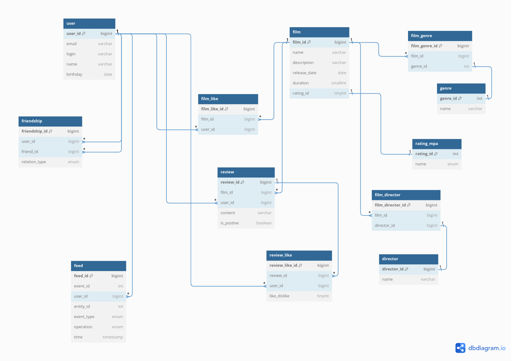

## Filmorate

Приложение, которое умеет обрабатывать и хранить данные о пользователях и их любимых фильмах.

Пользователи могут:

- Ставить лайки фильмам
- Писать отзывы
- Искать наиболее популярные по количеству лайков фильмы
- Искать фильмы по режиссёру
- Добавлять других пользователей в друзья

## Database structure



*https://dbdiagram.io/d*

````
Table user {
user_id bigint [primary key]
email varchar
login varchar
name varchar
birthday date
}

Table friendship {
friendship_id bigint [primary key]
user_id bigint
friend_id bigint
relation_type enum('friend', 'not_approved_friend')
}

Table film {
film_id bigint [primary key]
name varchar
description varchar
release_date date
duration int  
rating_id int
}

Table genre {
genre_id int [primary key]
name varchar
}

Table film_genre {
film_genre_id bigint [primary key]
film_id bigint
genre_id int
}

Table film_like {
film_like_id bigint [primary key]
film_id bigint
user_id bigint
}
Table  rating_mpa {
rating_id int [primary key]
name enum ('G', 'PG', 'PG-13',
'R', 'NC-17')
}
Table film_director {
film_director_id bigint [primary key]
film_id bigint
director_id bigint
}
Table director {
director_id int [primary key]
name varchar
}

Table review  {
review_id bigint [primary key]
film_id bigint 
user_id bigint 
content varchar
creation_date date
is_postive boolean
}
Table review_like {
review_like_id bigint [primary key]
review_id bigint
is_like boolean
}

Table feed{
feed_id bigint [primary key]
event_id int 
user_id bigint
entity_id int
event_type enum ('FRIEND')
operation enum ('ADD')
time timestamp 
}


Ref: user.user_id < friendship.user_id // one-to-many
Ref: user.user_id < friendship.friend_id // one-to-many
Ref: film.film_id < film_genre.film_id // one-to-many
Ref: genre.genre_id - film_genre.genre_id // one-to-one
Ref: film.film_id < film_like.film_id // one-to-many
Ref: user.user_id < film_like.user_id // one-to-many
Ref: film.rating_id - rating_mpa.rating_id // one-to-one
Ref: film.film_id < film_director.film_id // one-to-many
Ref: director.director_id - film_director.director_id // one-to-one
Ref: user.user_id < review.user_id // one-to-many
Ref: film.film_id < review.film_id // one-to-many
Ref: review.review_id < review_like.review_id // one-to-many
Ref: user.user_id < feed.user_id // one-to-many
````

## Примеры запросов

1) Получение общих друзей двух пользователей с id 1 и 2

````
SELECT * 
FROM "user"
WHERE user_id IN (
SELECT friend_id 
FROM "friendship"
WHERE user_id = 1 
INTERSECT 
SELECT friend_id 
FROM "friendship" 
WHERE user_id = 2)
````

2) Получение всех неподтверждённых друзей пользователя id = 2

````
SELECT * 
FROM "user"
WHERE user_id IN (
SELECT friend_id 
FROM "friendship"
WHERE user_id = 2 AND relation_type = 'NOT_APPROVED_FRIEND'
)
````

3) Получение 5 наиболее популярных фильмов по количеству лайков

````
SELECT f.FILM_ID, COUNT(fl.FILM_ID) as LIKES_COUNT
FROM "film" AS f
LEFT JOIN "film_like" AS fl ON f.FILM_ID = fl.FILM_ID 
GROUP BY f.FILM_ID
ORDER BY COUNT(fl.USER_ID) DESC 
LIMIT 5
````

4) Получение рейтинга по идентификатору

````
SELECT name
FROM "rating_mpa" rm
WHERE RATING_ID = 5
````

5) Создание фильма

````
INSERT  INTO  "film" (name, description, release_date, duration, rating_id)  
VALUES (?, ?, ?, ?, ?)
````

Отзывы:
айди
фильм айди
юзер айди
контент
время публикации
положительный/отрицательный boolean isPositive
лайки/дизлайки ReviewLike

Models:
Review
ReviewLike

Лента событий Feed
айди
айди события
айди юзера
тип события friend like review
операция (добавление в друзья/лайка, удаление)?
время ГГГГ-MM-ДД ЧЧ:ММ:СС

Режиссёр Director
Models:
Director
FilmDirector

 